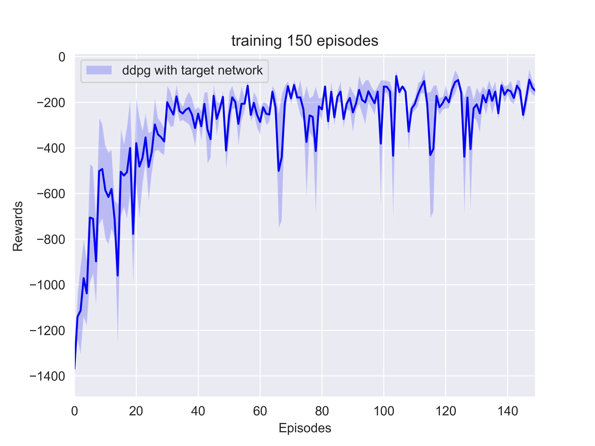

# ddpg-Pendulum

This repository is an implementation of deep deterministic policy gradient (DDPG) algorithm for OpenAI gym pendulum control. Actor-Critic architecture is used to generate actions and Q-values, target network is also used to stable the training procedure.

## Dependencies

- Python 3.7.3
- PyTorch 1.3.0
- OpenAI gym 0.15.7

## Training

Run `python3 train.py` to train the agent. The agent will converge to its optimal policy in about 50 episodes, following is the plot of rewards received after each episode (5 independent trials).

